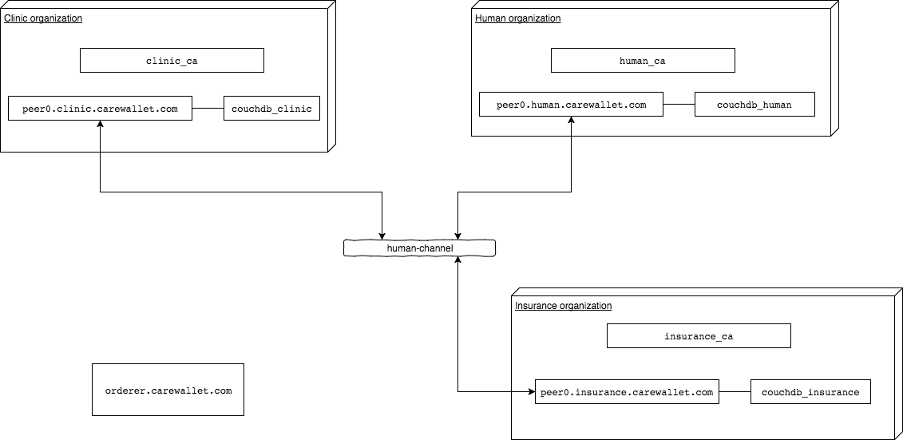

## Description

HealthClient class installing chaincode into channel, creates 3 users, and emulates paying from user to medic (without and with insurance) 


## Fabric network diagram



## How to run

```
mvn package
java -jar target/hyperledger-test-client-1.0-SNAPSHOT.jar 
```

## Creating channel artifacts (already created)

```
cd hyperledger-test-client/src/main/resources/health
export FABRIC_CFG_PATH=$PWD
```

Create genesis block:
```
./bin/configtxgen -profile ThreeOrgsOrdererGenesis -outputBlock ./channel-artifacts/genesis.block
```

Create a Channel Configuration Transaction:
```
./bin/configtxgen -profile ThreeOrgsChannel -outputCreateChannelTx ./channel-artifacts/health-channel.tx -channelID health-channel
```

Create anchor peers:
```
./bin/configtxgen -profile ThreeOrgsChannel -outputAnchorPeersUpdate ./channel-artifacts/ClinicMSPanchors.tx -channelID health-channel -asOrg ClinicMSP
./bin/configtxgen -profile ThreeOrgsChannel -outputAnchorPeersUpdate ./channel-artifacts/HumanMSPanchors.tx -channelID health-channel -asOrg HumanMSP
./bin/configtxgen -profile ThreeOrgsChannel -outputAnchorPeersUpdate ./channel-artifacts/InsuranceMSPanchors.tx -channelID health-channel -asOrg InsuranceMSP
```

## Generate crypto certificates

```
../bin/cryptogen generate --config=./crypto-config.yaml
```

## Generate proto classes

```
protoc --proto_path=src/main/resources/protos --java_out=src/main/java src/main/resources/protos/registerDoctor.proto
```

```
protoc --proto_path=src/main/resources/protos --go_out=src/main/resources/chaincode/schedule/src/care.solve.schedule src/main/resources/protos/registerDoctor.proto
```

## Start chaincode in dev mode

# Run local chaincode
```
CORE_CHAINCODE_LOGLEVEL=debug CORE_PEER_ADDRESS=127.0.0.1:8051 CORE_CHAINCODE_ID_NAME=scheduleChaincode_go:0 ./care.solve.schedule 
```

# Install and instantiate chaincode
Inside `cli` container run:
```
peer chaincode install -n scheduleChaincode_go -v 0 -p github.com/hyperledger/fabric/examples/chaincode/go/schedule/src/care.solve.schedule
peer chaincode instantiate -n scheduleChaincode_go -v 0 -c '{"Args":["someArg","0"]}' -o orderer.carewallet.com:7050 -C health-channel
```

